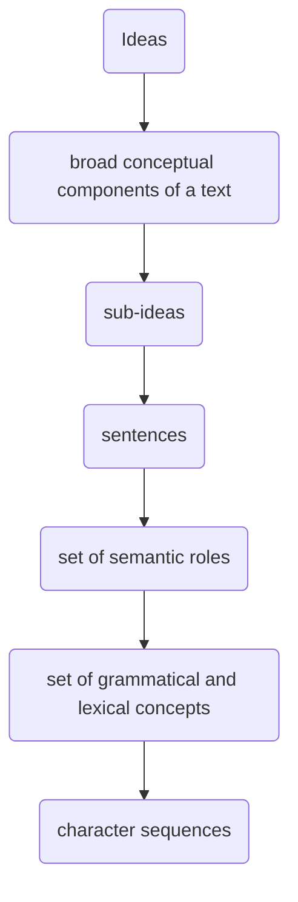

# Information Retrieval and Search

```bash
conda create -n ir python=3.11
conda activate ir
pip install -r requirements.txt
```

## 1. Introduction

Information retrieval is concerned with the _non-deterministic_ matching of a _query_ and _documents_ in large collections of _unstructured_ data (cf. data retrieval in a structured, deterministic context):

- Input: _Representation of text_.
- System: Given query `q`, index generation `d` yielding a `Ranking(q, d)` of relevant documents.
- Output: _Retrieval model_.
- (Retrieval Augmented Generation, RAG: additionally, extract & summarise)

Evaluation criteria in IR:

- **Effectiveness**: find _relevant_ documents.
- **Efficiency**: find them quickly in vast amounts of data, for search engine to be able to handle thousands of queries per second, i.e. _retrieval time, indexing time, index size_.
- **Usability**: e.g. flexibility.

Components:

- Documents: elements to be retrieved, unstructured but unique ID, different modalities (web pages, emails, tweets, DNA, photos, videos, etc.)
- Queries: text expressing user's information need, may be ambiguous or express multiple information needs (e.g. apple vs. Apple, jaguar vs. Jaguar), different modalities(keywords in web search, humming a tune in music search, etc.)
- (Relevant) documents: key idea is that _relevant items are similar_!

|             | DBs                                               | IR                                        |
| ----------- | ------------------------------------------------- | ----------------------------------------- |
| Data        | structured                                        | unstructured                              |
| Queries     | formally defined relational algebra - unambiguous | free text, natural language               |
| Retrieval   | exact, i.e. always correct                        | imprecise, i.e. need to measure relevance |
| Interaction | one-shot queries                                  | dynamic interactions                      |

IR systems:

1. Indexing process (offline) - get data into the system: crawl, assign unique ID, format conversion, creation of lookup table.
2. Search (retrieval) process (online) - (help user to) find relevant data: help user formulate query, fetch and present results to user, iterate.

### Bag of Words (BoW)

Key idea: re-ordering does not destroy the topic.

Most search engines use BoW. A match is measured by the degree of overlap between the document and the query. However, since word order is not considered, similarity measures will be the same for some distinct sentences. Alternatives include character n-grams or word n-grams.

### Text Preprocessing

Word elements are referred to as _terms_ (e.g. "pre" in "preprocessing") - which are candidates for an index entry.

Idea: Identify the optimal form of the term to be indexed that will lead to better match between different forms of words in document and query, to achieve the best retrieval performance.

1. Preparation of the document, e.g. removal of tags.
2. Lexical analysis: tokenisation (typically split at non-letter characters, issues / special cases e.g. URLs, Chinese without spaces, German with composite words, "San" "Francisco" vs. "San Francisco").
3. Removal of stopwords (optional; note: application-dependent, may be important e.g. "to be or not to be", "from A to B" - in web search trend to keep them, probabilistic retrieval models give them low weight; can manually exclude top $N$ terms).
4. Normalisation (optional; make words with different surface forms look the same):
   - Case folding, i.e. "A" -> "a".
   - Equivalence classes, e.g. "Ph.D.", "PhD".
   - Stemming, e.g. Porter algorithm, for morphological variations of words (limitations: different spellings, synonyms, irregular verbs; two types: dictionary-based, algorithmic; not words anymore but terms e.g. "inform retriev"!).
5. Term weighting (optional).

Same tokenisation/normalisation steps should be applied to documents & queries!
Stopword removal and normalisation can be done at indexing time or as part of query processing. Stemming usually achieves 5-10% improvement in retrieval effectiveness.

### Text Laws and Term Weighting

Define for a query $q$ and a document $d$ the retrieval score as the sum of weighted terms $\text{score}(q, d) = \sum_{t \in q \cap d}{w_{td}}$.

A weight is an importance indicator of a term regarding content:

- _Term frequency_: frequency of occurrence of the index term $i$ in document $j$. _Assumption_: High-frequency content signals main topics in the document!

  $$w_{ij} = \text{tf}_{ij}$$

**(Constant Rank-Frequency) [Law of Zipf](https://www.youtube.com/watch?v=fCn8zs912OE)**: rank-frequency exhibit a log-linear relationship: _the rank of a term by frequency times the probability of appearance of a term is constant over terms_ $r \times P_r \eqsim \text{constant} \rarr P_r \eqsim \frac{\text{constant}}{r} \rarr f(x) \eqsim \frac{1}{x}$; highly frequent words, e.g. "the", "of", "to", are _frequent in a lot of documents_ and might not necessarily be informative about a _particular_ document.

Phenomenon of _clumping / contagion_ in text: majority of words appearing more than once in a text appear close to each other.

**[Benford's Law](https://www.youtube.com/watch?v=XXjlR2OK1kM)**: similar to Zipf's law for terms, the first digit of a number (e.g. in energy bills, population numbers, term frequencies) decays in a similar fashion: $P(d) = \log(1 + \frac{1}{d})$.

**Heap’s law**: While going through documents, the number of new terms decreases over time: vocabulary growth $v(n) = k \times n^b, b < 1, \text{ typically } 0.4 < b < 0.7$.

- _Inverse document frequency_: $N$ = no. of documents in the reference collection, $\text{df}_i = n_i$ = document frequency, i.e. no. of documents in the reference collection having index term $i$. Addresses the issue of constant rank-frequency! (log scale used to dampen effect, i.e. first occurrence is more important!)

  $$w_{ij} = \text{idf}_i = \log\Big( \frac{N}{\text{df}_i} \Big) = \log\Big( \frac{N}{n_i} \Big)$$

- _TfIdf_: product of the number of times term $i$ appears in document $j$ ($\text{tf}_{ij}$; the higher the number of occurrences in a document the higher its importance) and the inverse of the number of documents term $i$ appears in ($\text{idf}_i$; the rarer the term in the collection, i.e. the lower the number of documents it appears in, the higher its importance).

  $$w_{ij} = \text{tf-idf}_{ij} = \text{tf}_{ij} \times \text{idf}_i$$

- _Length normalisation_: $l$ = no. of distinct index terms in the document. Without normalisation, long documents would have a higher weight purely by virtue of containing more words!

  $$w_{ij} = \frac{\text{tf}_{ij}}{\max_{1 < k < l}(\text{tf}_{kj})}$$

- _Augmented normalised term frequency_: smoothing term $\alpha$ usually equal to $0.5$.

  $$w_{ij} = \alpha + (1 - \alpha) \frac{\text{tf}_{ij}}{\max_{1 < k < l}(\text{tf}_{kj})}$$

  $\alpha = 0$ is equivalent to standard length normalisation:

  ```python
  import numpy as np

  tf = np.array([2., 1., 2., 1., 0.])

  def augmented_normalised_tf(tf, alpha):
      return alpha + (1 - alpha) * (tf / max(tf))

  for alpha in [0., 0.25, 0.5, 0.75, 1.]:
      print(augmented_normalised_tf(tf, alpha))
  [1., 0.5,   1., 0.5,   0.  ]
  [1., 0.625, 1., 0.625, 0.25]
  [1., 0.75,  1., 0.75,  0.5 ]
  [1., 0.875, 1., 0.875, 0.75]
  [1., 1.,    1., 1.,    1.  ]
  ```

### Ranked Retrieval Evaluation: Effectiveness

How "good" are the documents that are returned? Do the results satisfy user's information need?

- **Accuracy**: What fraction of documents was classified correctly? $A = \frac{TP + TN}{TP + FP + TN + FN}$
- **Precision**: What fraction of the retrieved documents are relevant? $P = \frac{\textcolor{blue}{\text{retrieved}} \land \textcolor{red}{\text{relevant}}}{\textcolor{blue}{\text{retrieved}}} = \frac{TP}{TP + FP}$
- **Recall**: What fraction of the relevant documents were retrieved? $R = \frac{\textcolor{blue}{\text{retrieved}} \land \textcolor{red}{\text{relevant}}}{\textcolor{red}{\text{relevant}}} = \frac{TP}{TP + FN}$

Recall is difficult to measure on the web. TODO: why?

```python
import numpy as np
import matplotlib.pyplot as plt

docs = np.array([1., 1., 1., 0., 1., 0., 1., 1., 0., 0., 1., 0., 1., 0., 0., 0., 0., 1., 0., 0., 0., 0., 0., 1.])

retrieved_and_relevant = docs.cumsum()
relevant = docs.nonzero()[0] + 1  # zero-indexing
precision = lambda retrieved: retrieved_and_relevant[retrieved-1] / retrieved
recall = lambda retrieved: retrieved_and_relevant[retrieved-1] / relevant.size

all = np.arange(docs.size) + 1
np.round(np.stack((all, precision(all), recall(all))), 2)
array([[ 1.  ,  2.  ,  3.  ,  4.  ,  5.  ,  6.  ,  7.  ,  8.  ,  9.  , 10.  , 11.  , 12.  , 13.  , 14.  , 15.  , 16.  , 17.  , 18.  , 19.  , 20.  , 21.  , 22.  , 23.  , 24.  ],
       [ 1.  ,  1.  ,  1.  ,  0.75,  0.8 ,  0.67,  0.71,  0.75,  0.67,  0.6 ,  0.64,  0.58,  0.62,  0.57,  0.53,  0.5 ,  0.47,  0.5 ,  0.47,  0.45,  0.43,  0.41,  0.39,  0.42],
       [ 0.1 ,  0.2 ,  0.3 ,  0.3 ,  0.4 ,  0.4 ,  0.5 ,  0.6 ,  0.6 ,  0.6 ,  0.7 ,  0.7 ,  0.8 ,  0.8 ,  0.8 ,  0.8 ,  0.8 ,  0.9 ,  0.9 ,  0.9 ,  0.9 ,  0.9 ,  0.9 ,  1.  ]])

pr_recall_levels = np.round(np.stack((relevant, recall(relevant), precision(relevant))), 2)
pr_recall_levels
array([[ 1.  ,  2.  ,  3.  ,  5.  ,  7.  ,  8.  , 11.  , 13.  , 18.  ,  24. ],
       [ 0.1 ,  0.2 ,  0.3 ,  0.4 ,  0.5 ,  0.6 ,  0.7 ,  0.8 ,  0.9 ,  1.  ],
       [ 1.  ,  1.  ,  1.  ,  0.8 ,  0.71,  0.75,  0.64,  0.62,  0.5 ,  0.42]])
plt.plot(pr_recall_levels[1], pr_recall_levels[2])
plt.show()
```

Retrieve more documents?

- Higher chance to find all relevant documents, i.e. higher recall.
- Higher chance to find more irrelevant docs, i.e. lower precision.

A single trade-off measure: $F_\beta = \frac{(\beta^2 + 1) PR}{\beta^2 P + R}$

- $\beta < 1$: emphasis on precision
- $\beta = 1$: harmonic mean (F1 score; P and R equally important)
- $\beta > 1$: emphasis on recall

Breakeven point: point in the PR graph where $P = R$.

How to take rank into account? **Precision @ K** where $K$ is a fixed number of documents: cut-off on the ranked list at rank $K$, then calculate precision. Perhaps appropriate for most web search: most people only check the top $K$ results. But averages badly. (TODO: why?)

**R-precision**: For a query with known $r$ relevant documents, R-Precision is the precision at rank $r$ (P@r). $r$ is different from one query to another! It examines the ideal case: getting all relevant documents in the top ranks. (TODO: is it realistic?)

The user would cut-off (stop inspecting results) at some point, say rank $x$. What is the optimal cut-off when a user would stop? **Mean Average Precision (MAP; most used)**: every time you find a relevant document, calculate P@x, then take the average at the end. This represents a mix between precision and recall, focused on finding relevant documents early (when $r = 1 \Rarr$ MAP = mean reciprocal rank $1 / k$):

$$AP = \frac{1}{r} \sum_{k=1}^n{P(k) \times \text{rel}(k)}, \quad MAP = \frac{1}{Q} \sum_{q=1}^Q{AP(q)}$$

- $r$ = number of relevant documents for a given query.
- $n$ = number of documents retrieved.
- $P(k) = P@k$.
- $\text{rel}(k) = 1$ if retrieved document @k is relevent, $0$ otherwise.
- $Q$ = number of queries in the test collection.

Note: Relevance in this case is binary, but also graded relevance (e.g. 0 to 5) can be used.

**Discounted Cumulative Gain (DCG)** uses graded relevance as measure of usefulness: lower-ranked documents are discounted by $1 / \log_2(\text{rank})$. Thus, $\text{DCG}_k$ is the total gain accumulated at a particular rank $k$ (the sum of DGs up to rank $k$):

$$\text{DCG}_k = \text{rel}_1 + \sum_{i=2}^k{\frac{\text{rel}_i}{\log_2(i)}}$$

**Normalised Discounted Cumulative Gain (nDGC; most used for web search)** averages DCG numbers across a set of queries at specific rank values DCG@k; s.t. an ideal ranking would have an nDCG of $1.0$.

## 2. Retrieval Models

Information retrieval (/ ranking / relevance) models are defined by:

- The **representation** of the document and query.
- The **ranking** function that uses these as arguments.

Model taxonomy:

- Simple (based on co-ocurrence / frequencies), _unsupervised_ (and can be applied to large datasets), focused on _topical relevance_ (necessary but not sufficient!) - therefore useful for an initial filtering of a large set of documents:
  - Set-theoretic (e.g. boolean): simple and efficient representation (as a set of index terms) but no ranking (only whether relevant or not).
  - Probabilistic (e.g. probabilistic language model): model the probability of relevance given a document and query.
  - Algebraic (e.g. vector space): simple and efficient representation (as vectors), ranking (similarity function between `d` and `q`).
- Link-based (e.g. PageRank)
- Neural network-based: learned vector representations of `q` and `d` through _supervision_ (need annotated data such as user profiles and behaviour to model intentional and motivational relevance).

A **retrieval model** $\langle D, Q, F, R(d_j, q_i) \rangle$:

- $D$ is the set of _representations_ of the _documents_ in the collection.
- $Q$ is the set of _representations_ of the _queries_.
- $F$ is a framework for modelling document and query _representations_, and their relationships.
- $R(d_j , q_i)$ is a _ranking function_ that takes a document and query representations $d_j \in D, q_i \in Q$ and returns a real number that expresses the potential relevance of $d_j$ to $q_i$ by which documents can be ordered.
- $K = k_1, \dots, k_t$ is the set of all index terms.
- $t$ is the number of index (_vocabulary_) terms in the collection.
- $w_{ij} \text{ or } w_{iq}$ is a weight associated with each index term $k_i$ of a document representation $d_j$ or query representation $q$:
  - $\mathbf{d_j} = [w_{1j}, w_{2j}, \dots, w_{tj}]$ is the term vector of $d_j$.
  - $\mathbf{q} = [w_{1q}, w_{2q}, \dots, w_{tq}]$ is the term vector of $q$.

### Boolean Models

The index term weight variables are all binary - match or no match: $w_{ij}, w_{iq} \in \{0, 1\}$.

A query $q$ is a Boolean expression in _disjunctive normal form (DNF)_:

$$\text{Query: } k_1 \land \lnot k_4$$
$$\text{DNF: } (0, 0, 0, 1) \lor (0, 0, 1, 1) \lor (0, 1, 0, 1) \lor (0, 1, 1, 1)$$

| Advantages | Disadvantages                                                          |
| ---------- | ---------------------------------------------------------------------- |
| Simplicity | Relative importance of index terms is ignored.                         |
|            | No ranking (only matching; may be that no document matches the query). |

Boolean retrieval is suitable for expert users with precise understanding of their needs and of the collection. _Patent search_, for example, uses sophisticated sets of Boolean queries to check search results, e.g. `(car OR vehicle) AND (motor OR engine) AND NOT (cooler)`. For the majority of users, manually defining custom Boolean queries and going through thousands of results (as there is no ranking!) is not suitable, e.g. in web search.

#### Extended Boolean Models

Hybrid model with properties of set theoretic and algebraic models: takes into account _partial fulfilment_ of the query and _sorts_ documents by relevance to obtain a ranking.

Note: disjunctive queries are good if far from the origin, conjunctive queries are good if close to $(1, 1)$.

### Bag of Words (BoW) Vector Space Models

Document and query are represented as term vectors with term weights $\geq 0$ in a $t$-dimensional space, where $t$ is the number of features (here terms) measured. Vector of concepts / topics with number of dimensions $k \ll$ number of index terms $t$.

A ranking of the documents is obtained with a distance / _similarity_ measure between document $d_j$ and query $q$: Manhattan distance, Euclidean distance, inner product similarity, cosine similarity (most popular), etc. (Euclidean) distance is large for vectors of different lengths, the angle is therefore a better of measure of similarity than distance ($\theta = 0 \equiv$ maximal similarity; note: the L2 norm $\Vert \cdot \Vert_2$ normalises the vectors' lengths):

$$\cos(d_j, q) = \frac{d_j^T \cdot q}{\lVert d_j \rVert \lVert q \rVert} = \frac{\sum_{i=1}^t{w_{ij} w_{iq}}}{\sum_{i=1}^t{w_{ij}^2} \, \sum_{i=1}^t{w_{iq}^2}}$$

Procedure:

1. Represent the query and documents as weighted TfIdf vectors.
2. Compute the cosine similarity score for the query vector and each document vector.
3. Rank documents w.r.t. the query by score.
4. Return the top K (e.g. $K = 10$) to the user.

TODO: disadvantage of BoW vector space models (below) and picture in this lecture with disadvantage mentioned in lecture 1.

| Disadvantages                                                                                  | Advantages                                                                          |
| ---------------------------------------------------------------------------------------------- | ----------------------------------------------------------------------------------- |
| Simplifying assumption that terms are not correlated and term vectors are pair-wise orthogonal | Partial matching: retrieval of documents that approximate the query conditions      |
|                                                                                                | Simple, efficient model with relatively good results → popular (e.g., SMART system) |

Vector space models (VSMs) are very heuristic in nature - there is no notion of relevance, and there is no interpretability of the components -, yet it still works well, with virtually any weighting scheme or similarity measure.

Probabilistic retrieval models explicitly define random variables and are specific about what their values are, stating the assumptions behind each step (watch out for contradictions!).

### Probabilistic Retrieval Models

Probabilistically retrieval is a problem of

- estimating the probability of relevance given a query, document, collection, etc. as accurately as possible, $P_\text{est}(R \mid D, Q, \text{collection, user profile, etc.}) \approx P_\text{true}(R \mid D, Q)$, and
- ranking the retrieved documents in decreasing order of the found probability of relevance, $P(R \mid D_{r1}, Q) > P(R \mid D_{r2}, Q) > \dots$.

Relevance is ultimately determined by the user's preference. How to estimate the _probability_ of relevance?

**Okapi BM25 Model**: Consider the random variables $D$ = document, $Q$ = query, $R \in \{r, \bar{r}\}$ = relevance (relevant, not relevant). Thus relevance can be framed as a _binary classification problem_ in which $P(R = r \mid D) + P(R = \bar{r}) = 1$ and a document is relevant:

$$P(R = r \mid D) > P(R = \bar{r})$$

Let $L_d$ be the number of terms in document $d$, $\bar{L}$ be the average number of terms in a document, typically $k = 1.5$. The Okapi BM25 ranking function is:

$$w_{td} = \frac{\text{tf}_{td}}{k \frac{L_d}{\bar{L}} + \text{tf}_{td} + 0.5} \times \log_{10}\big( \frac{N - \text{df}_t + 0.5}{\text{df}_t + 0.5} \big)$$

### Generative Relevance Models

**Query likelihood model**: a document is a good match to a query if the document model is likely to have generated the query.

$$
P(R = r \mid D, Q)
= 1 - P(R = \bar{r} \mid, D, Q)
\approxeq \log{ \frac{P(D \mid Q, R = r)}{P(D \mid Q, R = \bar{r})} }
$$

In a classical probabilistic model, the document is represented by a collection of its attributes $D = W_i, \dots, W_n$ (e.g. words or terms) and the probabilities are factorised across these attributes - estimated from the set of relevant and non-relevant documents (e.g. MLE):

$$P(D \mid Q, R) = \prod_{i=1}^n{ P(W_i \mid Q, R) }$$

Zero frequency problem: Vector space models use summation, which works more like an `OR` in Boolean search, and a missing term reduces the score only marginally. But with multiplication, missing one term makes the score zero. Document texts are a sample from the language model - missing words should not have zero probability of occurring. Solution: smoothing.

A mixture model mixes the _probability that the document generated the query_, i.e. $P(Q \mid D)$, with an estimate for unseen words from the general collection frequency, i.e. $(1 - \lambda) P(Q \mid C)$, where $C$ is the document collection and $\lambda$ is the Jelinek-Mercer smoothing parameter:

$$P(q_1, \dots, q_m \mid D ) = \prod_{i=1}^m{ \big( \lambda P_{MLE}(q_i \mid D) + (1-\lambda) P_{MLE}(q_i \mid C) \big) }$$

$\lambda$ controls the probability for unseen words:

- A high value of $\lambda$ is equivalent to a "conjunctive-like" search, i.e. tends to retrieve documents containing all query words.
- A low value of $\lambda$ is more disjunctive, suitable for long queries.

Evidence from multiple sources can be combined (with $cq_i$ = conceptual term, $w_l$ = content pattern such as a word image pattern):

$$P(cq_1, \dots, cq_m \mid D) = \prod_{i=1}^m{ \big( \alpha \sum_{i=1}^k{P(cq_i \mid w_l)P(w_l \mid D)} + \beta P(cq_i \mid D) + (1-\alpha-\beta) P(cq_i \mid C) \big) }$$

#### Inference Network Models

Representation as Bayesian Networks.

| Advantages                                                                                           | Disadvantages                                               |
| ---------------------------------------------------------------------------------------------------- | ----------------------------------------------------------- |
| Elegantly combines multiple sources of evidence and probabilistic dependencies                       | Computationally not scalable for querying large collections |
| Easy integration of representations of different media, domain knowledge, semantic information, etc. |                                                             |
| Good retrieval performance                                                                           |                                                             |

In summary:

- Vector space models: how query vector aligns with document vector.
- Probabilistic models: relevance probability of document given query.
  - BM25 model.
- Query likelihood models: likelihood of observing / generating sequence of terms $Q$ in a language model of document $D$.
  - similar effectiveness as BM25; and with more sophisticated techniques (topic models) can outperform BM25.

## 3. Probabilistic Representations: Topic Modelling

**Realisational chain** (Panini, 600-400BC):



**Topic modelling**: Unsupervised representation learning of latent topics.

- Uncover the hidden topical patterns of the collection.
- Annotate the documents according to these topics.
- Use the annotations to organize, summarize and search the texts.

**Generative model for documents**:

- Select a document $d_j$ with probability $P(d_j)$.
- Pick a latent class / concept $z_k$ with probability $P(z_k \mid d_j)$.
- Generate a word $w_i$ with probability $P(w_i \mid z_k)$.

That is, the observed word distributions $P(w \mid d)$ are modelled as the per-topic word distributions per topic $P(w \mid z)$ times the per-document topic distributions $P(z \mid d)$.

Trained on a large corpus, learn:

- Per-topic word distributions $P(w \mid z)$.
- Per-document topic distributions $P(z \mid d)$.

TODO: <https://opencourse.inf.ed.ac.uk/sites/default/files/2024-11/ttds24_15comparing-corpora-2.pdf>

### [Latent Semantic Analysis (LSA)](https://www.geeksforgeeks.org/latent-semantic-analysis/)

Derive semantic information from a word-document matrix:


Weakness: cannot capture polysemy. Probabilistic topic models are a solution to this.

### Probabilistic latent semantic analysis (pLSA)

_pLSA and LDA rely on a number of topics set a priori_.

Maximum likelihood: parameters that maximise the likelihood of the observed data. Exact likelihood is intractable, we have to _approximate_ it - by unsupervised learning from _raw_ data, approximate inference methods for parameter estimations in Bayesian networks:

- Expectation-maximization: _iteratively estimate_ the probability of unobserved, latent variables until convergence.
- Gibbs sampling: update parameters _sample_-wise.
- Variational inference: approximate the model by an easier one.

### Expectation-Maximisation (EM)

1. Initialise per-topic word distributions: $P(z_k \mid d_j)$ and per-document topic distributions $P(w_i \mid z_k)$. Then until convergence:
2. Expectation: compute probability of a topic $z_k$ for a word $w_i$ in a document $d_j$.

   $$P(z_k \mid d_j, w_i) = \frac{P(w_i \mid z_k) P(z_k \mid d_j)}{\sum_{l=1}^K{ P(w_i \mid z_l) P(z_l \mid d_j) }}$$

3. Maximisation: recalculate distributions by weighing expected probabilities by the frequency of $w_i$ in $d_j$ normalised across the topics

   $$P(w_i \mid z_k) = \frac{ \sum_{j=1}^D{ \#(d_j, w_i) P(z_k \mid d_j, w_i) } }{ \sum_{j=1}^D{ \sum_{i=1}^M{ \#(d_j, w_i) P(z_k \mid d_j, w_i) } } }$$

   and across the document collection

   $$P(z_k \mid d_j) = \frac{ \sum_{i=1}^M{ \#(d_j, w_i) P(z_k \mid d_j, w_i) } }{ \sum_{i=1}^M{ \sum_{l=1}^K{ \#(d_j, w_i) P(z_l \mid d_j, w_i) } } }$$

   where $n(d_j , w_i)$ is the frequency of $w_i$ in $d_j$, $K$ is the number of topics, $D$ is the number of documents in the collection and $M$ is the number of words in the vocabulary.

Disadvantages:

- risk of getting stuck in a local maximum.
- $P(z_k \mid d_j)$ is only learned for documents in the training set; for new documents: repeat EM by clamping the previously learned per-topic word distributions (called folding in).

### Latent Dirichlet Allocation (LDA)

Gibbs sampling - for training, and for inference (incl. for unseen documents!):

1. Update topic assignment probabilities:

   $$P(z_{ji} = k \mid z_{\lnot ji}, \mathbf{w}, \alpha, \beta) \propto \frac{n_{j, k, \lnot i} + \alpha}{n_{j, \cdot, \lnot i} + K \alpha} \, \, \frac{v_{k, w_{ji}, \lnot} + \beta}{v_{k, \cdot, \lnot} + \lvert V \rvert \beta}$$

2. Sample topic assignments:

   $$z_{ji} \sim P(z_{ji} = k \mid z_{\lnot ji}, \mathbf{w}, \alpha, \beta)$$

## 4. Algebraic Representations

- **One-hot encoding**: $[1, 0, 0], [0, 1, 0], [0, 0, 1], \dots$ with $t$ the size of the vocabulary, for discrete concepts such as words; no notion of similarity.
- **Bag of words (BoW)**: term frequency; ignores order of words; can be extended to bag of n-grams to capture local ordering of words.
- **Dense distributed representations**: each word represented by a dense vector (point in vector space) usually normalised between -1 and 1; dimension $k$ of the semantic representation usually much smaller than the vocabulary, $k \ll t$; obtained from LSI or neural networks.
- **Sparse distributed representations**.

### Latent Semantic Indexing (LSI)

LSI assumptions:

- The semantic information can be derived from a
  word-document co-occurrence matrix.
- The context of a word is defined as a document (although considering smaller contexts is possible).
- The words and documents can be represented as points in the Euclidean space.

Term vectors are mapped into a low dimensional space
associated with statistical concepts by means of dimensionality reduction. Retrieval of documents even when the query index terms are absent!

**Singular Value Decomposition (SVD)** aims to minimise reconstruction error by representing a matrix $A$ in a lower $k$-dimensional space in a way that keeps maximum variance. Generally a value of $k$ that works well on a development set is chosen.

### Neural Network-Based Representations

**Word embeddings**: each word is associated with a real-valued vector in $d$-dimensional space (usually $d = 100 - 1000$) learned by a neural network trained on language modelling in an **unsupervised** fashion.

Words are thus represented by the _local context_ in which they occur.

- Static embeddings: word2vec, CBOW, [skip-gram NNLM](https://blog.cambridgespark.com/tutorial-build-your-own-embedding-and-use-it-in-a-neural-network-e9cde4a81296).
- Contextual embeddings: ELMo, BERT, GPT.

|              | CBOW                                                       | Skip-gram NNLM                                          |
| ------------ | ---------------------------------------------------------- | ------------------------------------------------------- |
| Input        | context words within short window _without their position_ | the current word                                        |
| Hidden layer | linear function                                            | linear function                                         |
| Output       | the current word                                           | context words within short window, _not their position_ |

Word vectors are simple and effective and the trained model can also be used as a language model but it cannot handle polysemy and is a black box.

[BERT](https://www.kaggle.com/code/mdfahimreshm/bert-in-depth-understanding):

- Masked language modelling: 15% of random input tokens in each sequence are masked and the system has to predict the masked token.
- Next sentence prediction: 50% of the cases B is the actual next sentence of A, 50% of the cases B is just a random sentence from the corpus.

BERT-BASE: 12 transformer encoding layers, dimension of the hidden layers: 768, 12 self attention heads, 110 million parameters. For each token of the input we have 12 separate vectors each of dimension 768

- Word vector: use output of last hidden layer, or combination of vectors of layers (e.g., output of last four layers) by summing or concatenation
- Sentence vector: vector of CLS token or average last hidden layer of each token (vector dimension: 768)

How many dimensions should we allocate for each word? imension is a hyperparameter that can be optimized, typically the aim is a good trade-off between speed and task accuracy.

### Word Embeddings in IR

_How to represent document and queries based on word vectors?_

**Bag of words (BoW)**: document and query are represented as term vectors with term weights $\geq 0$ in a $t$-dimensional space, where $t$ is the number of features (here words) measured: $\mathbf{d}_j = [w_{1j}, w_{2j}, \dots, w_{tj}]$, $\mathbf{q} = [w_{1q}, w_{2q}, \dots, w_{tq}]$.

**Centroid model**: document and query are represented as term vectors $\mathbf{v}_i$ in a $d$-dimensional space, where $p$ is the number of words in $\mathbf{d}_j$ and $q$ is the number of words in $\mathbf{q}$: $\mathbf{d}_j' = \frac{\mathbf{v}_1 + \mathbf{v}_2 + \dots + \mathbf{v}_p}{p}$, $\mathbf{q}' = \frac{\mathbf{v}_1 + \mathbf{v}_2 + \dots + \mathbf{v}_q}{q}$.

Combined with a traditional bag-of-words model: $(1 - \alpha) \cos(\mathbf{d}_j, \mathbf{q}) + \alpha \cos(\mathbf{d}_j, \mathbf{q})$.

_How to build similarity or distance metrics that operate on sets of word vectors?_

**[Word mover's distance (WMD)](https://vene.ro/blog/word-movers-distance-in-python.html)**: treats text documents as a point cloud of embedded words.

WMD words flow in the direction of the arrows when one document has more context than the other. The thicker arrows indicate the flow to the closest word, the thin arrows indicate excess flow.

The distance between the two documents is the minimum cumulative distance that all words in document 1 need to travel to exactly match document 2.

**Language retrieval model**:

$$p(q_i \mid d_j) = \sum_{w_i \in d_j}{ P(q_i \mid w_i) P(w_i \mid d_j) }$$

where $P(q_i \mid w_i)$ is e.g. computed based on corresponding word vectors $\mathbf{q}_i$ and $\mathbf{w}_i$

$$P(q_i \mid w_i) = \frac{\cos(\mathbf{q}_i, \mathbf{w}_i)}{ \sum_{\mathbf{w} \in V}{\cos(\mathbf{q}_i, \mathbf{w})} }$$

where $V$ is the vocabulary.

## 5. Multimedia Information Retrieval

- Modality: a certain type of information and/or the representation format in which information is stored.
- Medium: means whereby this information is delivered to the senses of the interpreter.
- Multimodal: coming from multiple information sources, which consist of multiple types of content, i.e., multimedia content.
- Cross-modal: bridging several modalities.

Multimedia content is heterogeneous, each medium has its own type of features to form content representations. Neural network-based representations are increasingly used for each medium, and are useful to bridge between modalities!

### Image Processing

Images disambiguate language. Images can help with NLP tasks, e.g. coreference resolution.

- **Segmentation** in homogeneous segments: based on homogeneous (e.g., color) pixels.
- **Object detection**, e.g., based on segments or region proposal network.
- **Image captioning**
- **Scene graph detection**: complex image description, difficult to automate.

### Video Processing

Video data = sequence of frames (still images) shown at a specific rate per time unit.

Video segmentation:

- Detection of video shot breaks, camera motions.
- Boundaries in audio material (e.g., other music tune, changes in speaker).
- Textual topic segmentation of transcripts of audio and of close-captions.
- Heuristic cues (e.g., return of anchor person).
- Combinations of the above.

Video segment:

- Basic unit for retrieval.
- Indexed with objects and activities (cf. image processing).

### Audio Processing

- Segmentation into sequences: basic units for retrieval.
- Indexing:
  - Speech: transcripts of text.
  - Music: acoustic analysis (e.g. interval and rhythm detection, timbre and chord information, vocal timbre feature, vocal pitch feature, genre based feature, instrument based feature).

Semantic music annotation:

- Traditionally relies on many handcrafted features and machine learning models such as SVMs.
- Today the models rely on deep neural architectures such as recurrent neural networks (RNNs), convolutional neural networks (CNNs) or their combination.

### Cross-Media Linking of names and faces

Detection of faces in the image and of names in the text + linking. Objective: Find the most probable of the (many) possibilities. Optimisation problem solved with the EM algorithm.

Assumptions:

- Faces of the same person should have similar visual characteristics (color and shape parameters).
- A person is only shown once in the image.
- All names in the text referring to the same person are conflated to 1 name.
- On the basis of the structure of the text: some names are more likely to be shown (_picturedness_).
- On the basis of the structure of the image, some faces have a larger chance to be named (_namedness_).

Evaluation:

- Evaluation with "Faces in the wild" dataset: 11820 stories or image-text pairs with 5637 unique person faces and 8878 unique person names.
- F1 score of 72% (see paper).
- Impressive results given _no manual labelling_.

### Cross-Modal Latent Dirichlet Allocation

Learning of word representations from natural language corpora paired with images.

LDA:

- Trained on documents that contain visual and textual words compared to a model that is only trained on the textual data.
- Evaluation: word similarity task.
- Results: better and closer to how humans conceptualize certain words.

### Joint Multimodal Representations

- Early fusion: Feature level multimodal fusion: e.g., combined vector representation of textual features, visual features, metadata.
- Late fusion: Decision level multimodal fusion: e.g., relevance is computed per modality and relevance scores are combined (e.g., summing, averaging, maximum, minimum).
- Hybrid fusion, e.g. neural networks.

### Multimedia Retrieval

Classical multimedia retrieval:

- Textual query
- Content described with textual tags
- Text-based retrieval model

Multimedia query language:

- Fixed number of predicates for expressing conditions on the attributes, structure and content (semantics) of multimedia objects.
- Limited expressivity.
- Users prefer to use natural language e.g. Show me platform 9 at 15:10 on December 7, 2013

Query by example:

- E.g., finding a similar text, image, audio fragment
- Query and documents are in the same modality
- Similarity/distance is computed between representations (e.g.,
  feature vectors)
- Query = audio fragment: entered via a Musical Instruments
  Digital Interface (MIDI), query by humming

### Cross-Modal Retrieval

Training:

- Given paired image-text examples: fragments of images and fragments of sentences are embedded in a common space
- Learning of a mapping between the image and text fragments

Testing:

- Given image retrieve textual description
- Given textual description retrieve image

Retrieval:

- Represent images – texts based in the obtained intermodal
  vector space
- Use image-text alignment/similarity score as retrieval/ranking model

## 6. Learning to Rank (L2R)

Learning to rank is a supervised retrieval model.

TODO: merge this list with below sections

<https://opencourse.inf.ed.ac.uk/sites/default/files/2024-11/ttds24_18l2r.pdf>

- Purpose
  - Learn a function automatically to rank results effectively
- Point-wise approach
  - Classify document to R / NR
  - The function is based on features of a single object
    - e.g., regress the rel. score, classify docs into Relevant and NR
  - Very similar to classification
    - Examples of $(D,Q)$ pairs with labels 1 or 0
  - Classic retrieval models are also point-wise:
    - Calculate $score(Q, D)$
    - If $score(Q,D) > \theta$ then relevant else irrelevant
  - Referred to as information filtering
    - Standing query + new documents coming
    - Decide whether a new document is R or NR
- List-wise
  - The function is based on a ranked list of items
  - given two ranked list of the same items, which is better
- Pair-wise
  - The function is based on a pair of item
  - e.g., given two documents, predict partial ranking

What is relevance?

- **Topical relevance**: the subject of a document.
- **Motivational and interpretational relevance**: the purpose of the search, intended use of the information, background of the user, etc.

**Relevance ranking**:

1. First ranking is usually _unsupervised_ (based on the similarity between query and document representations): Assumes _topical relevance_, a _necessary but not sufficient_ condition. Gives some candidates.
2. Second ranking is _supervised_ (_learning to rank_): motivational and interpretational relevance. Using only the candidates identified by the first ranking.

Metrics for relevance ranking: # TODO: ranking metrics (Precision@k, MAP@K, nDCG@K)

1. Rank-aware evaluation metrics: (TODO: compare again with first lecture and Edinburgh lecture)

   - [Mean Average Precision (MAP)](https://towardsdatascience.com/learning-to-rank-a-complete-guide-to-ranking-using-machine-learning-4c9688d370d4): mean average precision (AP) metrics over all queries
   - [Discounted Cumulative Gain (DCG)](https://towardsdatascience.com/learning-to-rank-a-complete-guide-to-ranking-using-machine-learning-4c9688d370d4): for graded relevance; normalise with IDCG (see exercise), typically use 5 or 6 relevance classes $y_k$

     $$DCG = \sum_{k=1}^n{G_k D_k} = \sum_{k=1}^n{\frac{2^{y_k - 1}}{\log_2(k + 1)}}, \qquad G_k = 2^{y_k} - 1, \, D_k = \frac{1}{\log_2(k+1)}$$

     ```python
     def dcg(y_score, y_true, k):
         """DCG evaluation function. Note the importance of sorting by score!"""
         order = np.argsort(y_score)[::-1]
         y_true = np.take(y_true, order[:k])

         gains = 2 ** y_true - 1
         discounts = np.log2(np.arange(len(y_true)) + 2)

         return np.sum(gains / discounts)

     def ndcg(y_score, y_true, k):
         """nDCG evaluation function"""
         dcg_ = dcg(y_score, y_true, k)
         idcg = dcg(y_true, y_true, k)

         return dcg_ / idcg
     ```

   - Mean Reciprocal Answer Rank (MRAR): for question answering; mean (i.e. over queries) of the reciprocal of the rank of the relevant answer (where only one document is relevant)

2. Supervision:

   - Relevance feedback: Direct, or indirect (user profile) relevance judgement by the user
     - Pseudo relevance feedback: use top-ranking documents returned by the system.
     - User profiles: visited URLs, browsing / click behaviour, similarity of query and clicked pages, etc.
   - Behaviour data, etc.

Examples: `Q1: NRNNRRNNNNNR`, `Q2: RRNNNRNNRNNNRNR`. AP = $(\frac{1}{2} + \frac{2}{5} + \frac{3}{6} + \frac{4}{12}) / 4 = 0.433, \, (\frac{1}{1} + \frac{2}{2} + \frac{3}{6} + \dots) / 6 = 0.62$. $MAP = 0.53$. Note equal importance for all queries in dataset.

Learning to rank: use supervision to train a machine learning model for ranking.

In the LTR framework, the ranking function $f$ typically relies on functions for representing the query, the document, and their interaction:

$$f(q, d) = g\big(\phi(q), \psi(d), \eta(q, d)\big)$$

where $\phi, \psi, \eta$ are the _representative functions_ which extract features from $q, d$ and their interaction, respectively.

Pooling:

- Systems submit top 1000 documents per topic.
- Top 100 documents from each are judged.
  - Single pool, duplicates removed, random ranking.
  - Judged by the person who developed the topic.
- Treat unevaluated documents as irrelevant.
- Compute MAP (or others) down to 1000 documents.
- To make pooling work:
  - Large number of reasonable systems participating
  - Systems must not all "do the same thing"

Pooling, does it work?

- Judgments can’t possibly be exhaustive!
  - It doesn’t matter: relative rankings of different systems remain the same!
  - Chris Buckley and Ellen M. Voorhees. (2004) Retrieval Evaluation with Incomplete Information. SIGIR 2004.
- This is only one person’s opinion about relevance
  - It doesn’t matter: relative rankings remain the same!
  - Ellen Voorhees. (1998) Variations in Relevance Judgments and the Measurement of Retrieval Effectiveness. SIGIR 1998.
- What about hits 101 to 1000?
  - It doesn’t matter: relative rankings remain the same!
- We can’t possibly use judgments to evaluate a system
  that didn’t participate in the evaluation!
  - Actually, we can!
  - Justin Zobel. (1998) How Reliable Are the Results of Large-Scale Information Retrieval Experiments? SIGIR 1998

Classical models vs. ML in IR:

- Traditional LTR approaches:
  - $\phi, \psi, \eta$ are usually manually defined feature functions
  - $g$ can be any machine learning model such as logistic regression or a support vector machine
- Neural ranking models:
  - $\phi, \psi, \eta$ are learned from the training data, possibly using pretrained embeddings as inputs
  - In most cases, all the functions $g$, $\phi, \psi, \eta$ are encoded in the network structure

### Traditional LTR approaches

(Traditional becauses using feature vectors.)

- The pointwise approach:

  - Input: single query-document pair $(q_i, d_{ij})$
  - Output: relevance degree or class that represents that degree for each $(q_i, d_{ij})$
  - Training: optimise ranking model by directly and _independently_ predicting $f(q_i, d_{ij})$, where $y_{i, j}$ is the corresponding relevance annotation: $L(f; Q, D, Y) = \sum_i{ \sum_j{ L(y_{i, j} f(q_i, d_{ij})) } }$
  - Advantages: simple, easy to scale, transparent (e.g. user clicks can be used as relevance annotation $y_{ij}$).
  - Disadvantages: not very effective at ranking (does not consider document preference or order information because makes _assumption that relevance is absolute: documents are judged_ **independently**)

- The pairwise approach:

  - Input: pairs of documents
  - Output: pairwise preference for a query $q_i$: if $d_{ij}$ is preferred over $d_{ik}$, $f(q_i, d_{ij}) > f(q_i, d_{ik})$
  - Training: consider possible document pairs (training slower $n(n+1)/2$)
  - Advantages: no assumption of absolute relevance, ranking based on document pairs and their relevance order w.r.t. a given query, usually effective
  - Disadvantages: in practice, it is often impossible to satisfy all found pairwise preference relationships to find the best global ranking, but not all pairs are usually considered equally important because _errors in top positions are worse than errors lower down the ranking - and pairwise classification does not capture this_!

- The listwise approach:

  - Input: a set of documents (or their features) associated with the query $q_i$, e.g. $D_i = \{d_{ij}\}_{j=1}^{n_i}$ (usually a ranked list)
  - Output: ranked list (or permutation) of the documents
  - Listwise loss function: the position of the documents in the final results are visible to the loss function - this approach learns to rank
    - Measure-specific loss functions: _directly optimise IR evaluation metrics_, e.g. MAP, SVM-MAP, AdaRank, SoftRank, LambdaRank, RankG, where $y_i$ is the ground truth list and $\pi_i$ is the list of documents sorted by $f$: $L(f; Q, D, Y) = \sum_i{\big(1 - AP(\pi_i, y_i)\big)}$.
      - The constraints in a [structured SVM](https://www.datacamp.com/tutorial/svm-classification-scikit-learn-python) enforce that correct ranking is given higher weight than any other possible rankings of the document. _Maximise margin and metric_: For AP, the true labelling is a ranking where the relevant _documents_ are all ranked in the front. Optimisation problem is not directly solved, instead, it is solved w.r.t. the constraints with highest violations.
    - Non-measure-specific loss functions, e.g. ListNet, ListMLE.

### Neural approaches

End-to-end neural network models bypass feature engineering and learn the features of complicated tasks based on raw input data. NNs outperform traditional approaches when data size is big.

- Symmetric vs. asymmetric architectures:
  - Symmetric network structure: query ($q$) and document ($d$) inputs are homogeneous
  - Asymmetric network structure: query ($q$) and document ($d$) inputs are heterogeneous, e.g. query split model, document split model, one-way attention model
- Representation- (and then just using e.g. a cosine similarity to determine interaction) vs interaction-focused architectures (e.g. Transformer)
  - Hybrid approaches

**Optimisation for relevance AND diversity of search results**: search results should cover various facets.

1. Discover the information facets for a specific query
2. Assess the relevance of a document to a particular facet
3. Order the results (e.g. optimisation of an objective function)

Marginal relevance?

In alternative approaches steps 1 and 2 are skipped:

- Minimization of similarities across documents (cf. Maximal Marginal Relevance) framework
- Maximization of implicit user feedback

This fits the framework of listwise models: instead of predicting the relevance of the documents independently, an entire ranking is predicted.

## 7. Web Information Retrieval

[Semantic web](https://devopedia.org/semantic-web): web of documents (with hyperlinks) vs. web of data (with typed links)

- Web data is massive:
  - Challenging for efficiency, but useful for effectiveness
- PageRank:
  - Probability that a random surfer is currently on page x
  - The more powerful pages linking to x, the higher the PR
- Anchor text:
  - Short concise description of target page content
  - Very useful for retrieval
- Spam:
  - Link spam, Anchor text spam

Issues specific to web:

- Web users:
  - Can be anybody ⇒ very heterogeneous needs, background, etc.
  - Give short, ambiguous queries in different languages, increasingly in different modalities
  - Are unwilling to examine many results
- Relevance:
  - No clear semantics, contrast:
    - "William Shakespeare"
    - Author history’s? list of plays? a play by him?
  - Inherent ambiguity of language:
    - polysemy: "Apple", "Jaguar"
  - Relevance highly subjective
- **Heterogeneous** content:
  - Multiple formats: structured (e.g., tables) and unstructured, semi-structured
  - Multiple media types (text, images, video, audio)
  - Text: different languages and writing systems
  - Static (documents, e.g. text, images) vs dynamic (generated on request)
  - Public vs proprietary (restricted authorization)
- Highly volatile: can be added and removed easily
- Redundant and often of low quality
- Large volumes: **scaling** issues
  - For Web search, larger index usually would beat a better retrieval algorithm
- **Link** based retrieval models

### Crawling

Search engines do not cover all the Web: size covered can differ per search engine

- _Start with a seed set of URLs_
- _Follow links, fetch and parse them (and repeat)_:
  - Breadth- vs. depth-first search
  - Structural: use organization of page to determine best links
  - Priority criteria: e.g., PageRank, popularity
- Difficulty: avoid visiting URLs more than once
- Challenge - the invisible / hidden / deep web: no links referencing them, protected by passwords or generated by querying, protected digital libraries or databases

Processing Steps in Crawling

1. Pick a URL from the frontier
   - Can include multiple pages from the same host
   - Must avoid trying to fetch them all at the same time
   - Must try to keep all crawling threads busy
2. Fetch the document at the URL
3. Parse the document
   1. Extract links from it to other docs (URLs)
4. Check if document has content already seen
   1. If not, add to indexes
5. For each extracted URL
   1. Ensure it passes certain URL filter tests
   2. Check if it is already in the frontier (duplicate URL elimination)

Strategies:

- Distributed crawling
- Incremental crawling: Strategy to (re)visit pages efficiently using knowledge of:
  - The structure of the Web
  - The rate at which pages or sites change
  - The field in a Web page that most likely changes

### Indexing

Search engine indices contain:

- Natural language index terms (see [Indexing, Compression and Search](#8-indexing-compression-and-search))
- Web page address (URL: Uniform Resource Locator): file name and extension
- Link structure, in-degree, out-degree
- Anchor text (text of a link): description of destination page (short, descriptive like a query), used when indexing page content, weighted according to PageRank of linking page
- Image descriptors and representations
- ...

Indices are organized over different servers. Index servers are managed by brokers. Efficient (Google is believed to processes 75TB of content in a single second !)

### Ranking

Mechanism is different per search engine:

- Similarity based (similarity of content) [See lecture 2 on Retrieval Models]
- Learning to rank approaches [See lecture 6 on Learning to Rank]
- Augmented with link-based, geo-parsing, URL/anchor based, credibility-based approaches

**Link-based**:

- Idea: treat web links as votes of authority/credibility
- Most popular link-based algorithms:
  - [PageRank (Brin and Page, 1998)](http://ilpubs.stanford.edu:8090/422/1/1999-66.pdf)
  - HITS (HyperText Induced Text Selection/Topic Search, Kleinberg (1999)) (assumed to be integrated in the Ask search engine)

PageRank: Model the probability that a random surfer clicks a link on a page (browsing) or jumps to a different page (teleportation).

- Models the web as a directed graph
  - Assumption 1: a hyperlink between pages denotes author perceived relevance (quality signal)
  - Assumption 2: the text in the anchor of the hyperlink describes the target page (textual context)
  - Interprets a link from page A to page B as "a vote"
- Good for underspecified queries. E.g., for query "Stanford University" the University homepage is listed first.
- Works well against spam
- Possible additional criteria to consider:
  - Page content and structure (see topic-oriented PageRank)
  - Site content and structure
  - Explicit feedback
  - Implicit feedback

Link-based ranking pioneered by Google. Blew away all early search engines. PageRank is still used in the Google search engine but is just one feature at this point. Machine-learned ranking (learning to rank, L2R) is heavily used. Still, PageRank remains a very useful feature.

**Personalized PageRank**:

- Easy to incorporate if we have a personalized teleport and follow/browsing matrix for each user, but in practice not feasible
- Research into convenient and efficient ways to incorporate personalization

**HITS algorithm**: Hubs and authorities

Ranking:

- Phase 1: ranking with simple retrieval models, using a small fast index of pages with high authority
- Phase 2: ranking of retrieved subset:
  - Taking into account advanced features of webpages
  - Taking into account user information
  - Using learning to rank algorithms [see Lecture 6]

Credibility:

- Topic based features: topic comparison with reliable sources
- Message based features: e.g., style, sentiment, etc.
- User based features: linkage with other users
- Link based features: linkage with reliable sources (e.g., AgeRank for ranking kids pages)

Geo-parsing:

- Matching of geographic location of user and Web page
- User: IP-address
- Web page: IP-address, cues extracted: locations, country and area codes of phone numbers, language

### Users and results

Queries:

- Typically very short (1-3 terms)
- Ambiguous
- Wrong spellings
- Zipf distributed

Types:

- 10% navigational: e.g., home page finding
- 80% informational
- 10% transactional

Evaluation of web search engines: A/B testing

- Divert a small proportion of traffic (e.g. 1%).
- Compute the effectiveness measure for every query for both retrieval systems (note: AP not MAP).
- Significance test: Compute a test statistic based on a comparison of the effectiveness measures for each query.

Search engines for the Internet of Things:

- IoT = network of physical objects (things) that are embedded with sensors, software, and other technologies for the purpose of connecting and exchanging data with other devices and systems over the internet.
- This data can be mined
- Web-like data: big, heterogeneous and extremely volatile
- Queries: generated by user and machine
- IoT search engines have to be very _fast, reliable, accurate and secure_

Smart vehicles access traffic information, weather conditions, location information, movements of other vehicles, combined with visual data (e.g., detected pedestrians) and news

What have we learned?

- Many challenges in Web IR (dynamic nature, large scale, short queries, heterogeneous content of Web pages, heterogeneous background of users)
- High precision of the top search results is important
- Link structure helps to discriminate authoritative pages from less important ones
- Scalability is a limiting factor in integrating advanced indexing and ranking techniques: everything has to go fast
- Optimally making use of green energy is another optimization problem

## 8. Indexing, Compression and [Search](https://www.youtube.com/watch?v=BNHR6IQJGZs)

Data structures and techniques for efficient storage and search:

- In-memory: SkipList, hash index.
- Document search: Inverted index.

Considerations:

- Inverted files: Sublinear search time and space requirements
- Index terms, postings and dictionaries can be compressed
- Trade-off between compressing/decompressing speed
- Trade-off between space and time overhead

### Indexing structures (indices)

**Indices** are auxiliary data structures designed to speed up the search of the document representations when querying the document collection.

#### Inverted files

An inverted file or index is a sorted list of index terms and their postings, e.g. `243, (<5,1,[45]>, <9,2,[4,1001]>, ...)`:

- An **index term** can be:
  - A unique (stemmed) word (not stopword) or phrase that occurs in the document collection [see Lecture 2].
  - Assigned descriptor (e.g., label assigned to text or image, XML-tag, ...)
- **Postings** are pointers to the documents in which the index term occurs:
  $$\langle d, f_{d,t}, [o_1, \dots, o_{f_{d,t}}] \rangle$$
  - $d =$ identifier of a document containing term $t$
  - $f_{d,t} =$ frequency of $t$ in $d$
  - $o_i =$ positions in $d$ at which $t$ is observed

Space requirements for text databases of a vocabulary of unique terms:

- Heap's law: vocabulary of size $n$ grows as $\mathcal{O}(n^\beta)$ where $\beta \in [0, 1]$ (often $\in [0.4, 0.6]$) dependent on the type of text.
  - For every new document there will be some new words that weren't in previous documents, but for every new document there will be fewer new words.
- The vocabulary size can be reduced with stopword removal, stemming, etc.

Space requirements for postings depend on the number of documents that contain the term. In practice, usually extra space requirements of 30% to 40% of the text size - _need for compression_!

#### Nextword indices

#### Taxonomy indices

#### Distributed indices

- Document-distributed index: Inverted file on each server contains all index terms, document ids are distributed over several servers. Query is sent to all nodes.
  - Disadvantage: scalability
  - Advantage: privacy (preventing data leakage by separating different types of documents, e.g. more sensitive documents)
- Term-distributed index:
  - Inverted file on each server contains a subset of index terms with complete information for all documents
  - Each query is referred to a subset of the nodes that hold relevant information
  - Advantage: scalability, query will be faster

Query processing:

- Pipelined query processing with a term-partitioned xyz
- MapReduce

#### Inverted files: searching

- Lexicographical ordering of key terms
  - Competitive in search speed: $\mathcal{O}(\log{n})$ where $n =$ the number of terms
- Vocabulary trie, B-tree: faster search
- Hashing: faster search
  - Hash table of index terms. Constant $\mathcal{O}(1)$ search time. Hash table size should be a function of dataset size.

LTR approaches create dense vector representations of document and query. Dense representations are not efficient for matching => Sparse LTR representations! (TODO: check for homework exercise)

### Compression and searching

**Compression** techniques are for encoding data in fewer bits or bytes to reduce storage space and for faster transmission.

- Index compression: postings, dictionaries.
- Searching over compressed data (limited use).

Data compression:

- **Lossless compression**: ensures that the data recovered from the compression/decompression process is exactly the same as the original data
- **Lossy compression**: does not ensure that data recovered from the compression/decompression process is exactly the same as the original data:
  - In IR: LSA, topic models, embeddings, etc.
  - Beyond: e.g., JPEG, MPEG
    Encoder (compressor) and decoder (decompressor)

Complexity:

- Time:
  - Compressing: $n-1$ iterations (TODO: check slides again, diagram for iterations?) where nodes are sorted, $\mathcal{O}(n \log{n})$
  - Decompressing (assigning codewords to symbols): $\mathcal{O}(n)$
- Space: needs a preamble (dictionary of symbols and codes) for decompression
  - Canonical Huffman codes save space.

Byte oriented Huffman coding: Less compression than bit-based, but searching and decompression are faster. (TODO: why faster?)

- Plain Huffman: uses bytes as the symbols of the target alphabet
- Tagged Huffman: 7 bits used for the code; the first is a flag signaling whether the byte is the first of its codeword
- End-tagged dense code: 7 bits used for the code; the first is a flag signaling whether the byte is the last of its codeword
  - Source symbols sorted with decreasing probabilities

TODO: see textbook.

- If $\Delta$-values follow a geometric distribution: Golomb / Rice coding.
- If $\Delta$-values are small: interpolative coding.
- If $\Delta$-values follow a wide range of distributions: Huffman-based LLRUN.

High query processing performance needs extremely efficient decoding (order of few nanoseconds per posting). => v-byte and Simple-9 are good solutions!

## 9. Clustering

Data represented by a matrix $A_{n \times p} = \begin{bmatrix}
  x_{11} & x_{12} & \dots & x_{1p} \\
  x_{21} & x_{22} & \dots & x_{2p} \\
  \vdots & & \ddots & \vdots \\
  x_{n1} & x_{n2} & \dots & x_{np} \\
\end{bmatrix}$ where $n$ is the number of objects to be clustered, $p$ is the number of features (attributes, variables) measured.

Hard clustering (hard separation) vs. soft clustering

Cluster representation:

- Centroid: average vector of objects in each cluster.
- Representative object, e.g. medoid object that has the least average (or total) distance or largest average similarity with all other objects of its cluster.

Distance and similarity functions: (see [Retrieval Models](#2-retrieval-models))

- Symmetric functions: e.g., Euclidean distance, cosine function, ...
- Asymmetric functions: e.g., Kullback-Leibler divergence
- Other application-dependent functions or kernel functions that compute the similarity between structured objects (e.g., strings, trees)

Proximity functions between two clusters:

- Maximum proximity: defines proximity based on their most similar pair of objects
- Minimum proximity: defines proximity based on their least similar pair of objects
- Average proximity: defines proximity based on the average of the similarities between all pairs of objects
- Mean proximity: defines proximity based on the similarity of the representative (e.g., centroid, medoid) of each cluster

Cluster algorithm types:

- Sequential algorithms: Build the clustering in one or few iterations.
  - Single pass algorithm: in one pass all n objects are assigned to their closest cluster based on a threshold similarity value
- Hierarchical algorithms
  Agglomerative clustering:
  - Starts from $n$ individual objects which in consequent steps are grouped in more general clusters and finally into $1$ cluster
  - Methods differ in their definition of proximity between clusters:
    - Single link(age) (nearest neighbor) clustering:
      - Use of the maximum proximity function
      - Might generate drawn out clusters
    - Complete link(age) (furthest neighbor) clustering:
      - Use of the minimum proximity function
      - Tends to produce very compact clusters with small diameter
    - Group average link(age)
      - Use of the average proximity function
      - Generates roughly ball shaped clusters
      - Efficient variant: based on the mean proximity function
  - Divisive clustering: A complete collection of n objects is divided in smaller and smaller groups until the $n$ single objects are found
    - Iteratively split clusters in a few clusters by means of a partitioning algorithm
    - Distinct advantage: possible to generate few large clusters early in the clustering process
- Algorithms that optimize an objective function $J$; the number of clusters $k$ is usually fixed
  - K-means
  - Spectral clustering: The collection of objects is seen as an undirected graph, and the task of clustering is to find the best cuts in the graph optimizing certain criterion functions

Complexity:

- Single pass: time: close to O(n) when n is large and number of clusters is small
- Hierarchical (agglomerative): time: O(n3), but can be reduced (see textbook).
- k-means: when n is large and numbers of clusters and iterations are small: time complexity close to O(n).

Number of clusters? Different heuristics taking into account intra- and inter-cluster similarity between objects of the clustering.

Evaluation:

- In case of no ground truth clusters (most often):
  - Evaluation by manual inspection
  - Evaluation based on heuristic objectives (e.g., degree of fitness, see textbook).
- In case of ground truth clusters:
  - E.g. Normalized Mutual Information (NMI)

Deep clustering: Optimizing objective is typically composed of two parts:

1. Network loss: feature learning: e.g., reconstruction loss of an autoencoder (AE), of a variational autoencoder (VAE) or the adversarial loss of a generative adversarial network (GAN)
2. Clustering loss: encourages the feature points to form groups or become more discriminative: e.g., k-means loss, penalization of proximity to each cluster centroid

Applications of clustering in IR:

- Term clustering:
  1. Feature vector of terms used as word embeddings.
  2. Similarity matrix built with cosine distances between each term.
  3. Clustering based on this similarity matrix.
  - Application: Query expansion = identifying terms that are related to the query terms (e.g. have the same meaning - thesaurus / sets of synonyms) and adding them to the query; related terms are learned from a large corpus / already retrieved docs judged relevant.
- Document clustering:
  1. Document-term matrix or use of word embeddings to construct document vectors.
  2. Document-to-document association matrix (NMT) or cosine similarity matrix between document vectors.
  3. Clustering based on the association / similarity matrix.
  - Applications: Document ranking, information visualisation.
- Search tasks and subtasks clustering

Non-Negative Matrix Factorisation (NMF): Factor term-document matrix $A_{n \times m}$ into a _term-cluster matrix_ $*_{n \times k}$ and a _cluster-document matrix_ $V_{k \times n}$.

- Each element $u_{ij}$ of the term-cluster matrix $U$ represents the degree to which term $w_i$ belongs to cluster $j$ (soft clustering).
- Each element $v_{ij}$ of the cluster-document matrix $V$ indicates to which degree document $d_j$ is associated with cluster $i$ (soft clustering).
- Hard clustering: cluster with largest value.

Query expansion: useful for specific applications, fails when context is important (-> relevance feedback!)

- Automatic thesaurus based on co-occurrence:
  - Words co-occurring in a document/paragraph are likely to be (in some sense) similar or related in meaning
  - Built using collection matrix (term-document matrix)
  - For a collection matrix $A$, where $A_{t,d}$ is the normalised weight of term $t$ in document $d$, similarity matrix could be calculated as follows: $C = AA^T$ where $C_{u,v}$ is the similarity score between terms u and v. The higher the score, the more similar the terms
  - Advantage: unsupervised
  - Disadvantage: related words more than real synonyms
- Automatic thesaurus based on parallel corpus:
  - Parallel corpus are the main training resource for machine translation systems
  - Nature: sets of two parallel sentences in two different languages (source and target language)
  - Idea: More than one word in language X can be translated into the same word in language Y -> these words in language X could be considered synsets (synonym sets)
  - Requirement: the presence of parallel corpus (training
    data) -> supervised method

Cluster-based retrieval: documents similar in content tend to be relevant to the same queries (Van Rijsbergen, 1979):

- Clustering of documents in the collection, clusters are represented e.g. by their centroid.
- Query is matched against cluster centroids.
- For partition clustering: matching condition, e.g., minimum similarity threshold to the centroid.
  - All documents in the matched clusters are returned
- For hierarchical clustering: tree is processed downward, taking the highest scoring branch, until some stopping condition (e.g., minimum similarity threshold) is met.
  - Subtree at that point is returned

Clustering on huge document collections is not feasible. Solutions:

- Clustering a sample of documents and assigning the other documents to the cluster with the most similar centroid or medoid.
- Splitting the collection, clustering each set, clustering centroids or medoids from the complete collection; merging clusters where necessary.

Open research challenge:

- Algorithms that do not rely on threshold similarity values or a fixed number of clusters.
- Computationally efficient algorithms.

In summary, clustering is a valuable unsupervised technique that can be applied to any type of data that can be represented with feature vectors.

- It has many applications in text and multimedia mining and search:
  - Term clustering for query expansion
  - Document clustering:
    - Cluster-based retrieval
    - Information visualization
  - Search tasks and subtasks clustering
  - Improving supervised learning

Clustering can be useful in a supervised setting (useful for learning-to-rank, see lecture 6). E.g. Chen et al. (2017) use intra and inter-cluster objectives and found it to decrease the generalization error of models.

## 10. Categorization

TODO: <https://opencourse.inf.ed.ac.uk/sites/default/files/2024-11/ttds24_16text-classification.pdf>

Semantic labelling of documents for filtering, using supervised learning, e.g. spam detection.

Feature selection, naive Bayes model, support vector machines, (approximate) k-nearest neighbor models

Deep learning methods

Multilabel and hierarchical categorization

Convolutional neural network (CNN) based hierarchical categorization

## 11. Dynamic Retrieval and Search

Reinforcement learning from user interactions.

Static versus dynamic models

Markov decision processes

Multi-armed bandit models

Modelling sessions

Online advertising

Document segmentation, maximum marginal relevance

Summarization based on latent Dirichlet allocation models and long short-term memory (LSTM) networks

Abstractive summarization with attention models

Multidocument summarization, search results fusion and visualization

## 12. Question Answering, Conversational Search and Recommendations

- IR-based (visual) QA
- Conversational search and recommendation (including LLM-based chatbots)

Retrieval based question answering

Deep learning methods including attention models

Cross-modal question answering

E-commerce search and recommendation

## 13. [Retrieval Augmented Generation (RAG)](https://www.dailydoseofds.com/a-crash-course-on-building-rag-systems-part-1-with-implementations/)

Retrieval Augmented Generation (RAG): Allows to add e.g., domain-specific information to the LLM

1. Retrieves a set of relevant documents/paragraphs/sentences with a common information retrieval technique
2. Models an interaction with a large language model (LLM) by prompting the LLM with the retrieved information as context (context aware reasoning)
3. The LLM autoregressively generates the answer by attention over the prompt

TODO: <https://opencourse.inf.ed.ac.uk/sites/default/files/https/opencourse.inf.ed.ac.uk/ttds/2024/20-rag-handout.pdf>
