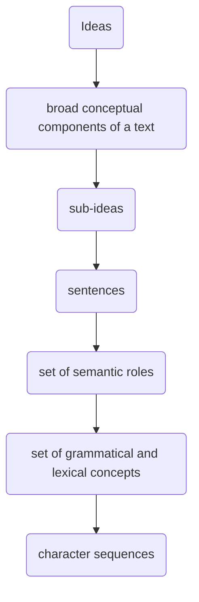

# Information Retrieval and Search

```bash
conda create -n ir python=3.11
conda activate ir
pip install -r requirements.txt
```

## 1. Introduction

Information retrieval is concerned with the _non-deterministic_ matching of a _query_ and _documents_ in large collections of _unstructured_ data (cf. data retrieval in a structured, deterministic context):

- Input: _Representation of text_.
- System: Formulation `q`, index generation `d` yielding a `Ranking(q, d)` of relevant documents.
- Output: _Retrieval model_.

### Text Preprocessing

1. Preparation of the document, e.g. removal of tags.
2. Lexical analysis: tokenisation.
3. Removal of stopwords (optional).
4. Stemming (optional), e.g. Porter algorithm.
5. Term weighting (optional).

### Text Representation and Similarity

Bag of Words (BoW) does not capture word order (and consequently similarity measures will be the same for some distinct sentences). Alternatives include character n-grams or word n-grams.

### Term Weighting

A weight is an importance indicator of a term regarding content:

- _Term frequency_: frequency of occurrence of the index term $i$ in document $j$. _Assumption_: High-frequency content signals main topics in the document!

  $$w_{ij} = \text{tf}_{ij}$$

**(Constant Rank-Frequency) Law of Zipf**: rank-frequency exhibit a log-linear relationship; highly frequent words are frequent in a lot of documents and might not necessarily be informative about a particular document.

- _Inverse document frequency_: $N$ = no. of documents in the reference collection, $n_i$ = no. of documents in the reference collection having index term $i$. Solves the previous issue!

  $$w_{ij} = \text{idf}_i = \log\Big( \frac{N}{n_i} \Big)$$

- _TfIdf_:

  $$w_{ij} = \text{tf-idf}_{ij} = \text{tf}_{ij} \times \text{idf}_i$$

- _Length normalisation_: $l$ = no. of distinct index terms in the document. Without normalisation, long documents would have a higher weight purely by virtue of containing more words!

  $$w_{ij} = \frac{\text{tf}_{ij}}{\max_{1 < k < l}(\text{tf}_{kj})}$$

- _Augmented normalised term frequency_: smoothing term $\alpha$ usually equal to $0.5$.

  $$w_{ij} = \alpha + (1 - \alpha) \frac{\text{tf}_{ij}}{\max_{1 < k < l}(\text{tf}_{kj})}$$

  $\alpha = 0$ is equivalent to standard length normalisation:

  ```python
  import numpy as np

  tf = np.array([2., 1., 2., 1., 0.])

  def augmented_normalised_tf(tf, alpha):
      return alpha + (1 - alpha) * (tf / max(tf))

  for alpha in [0., 0.25, 0.5, 0.75, 1.]:
      print(augmented_normalised_tf(tf, alpha))
  [1., 0.5,   1., 0.5,   0.  ]
  [1., 0.625, 1., 0.625, 0.25]
  [1., 0.75,  1., 0.75,  0.5 ]
  [1., 0.875, 1., 0.875, 0.75]
  [1., 1.,    1., 1.,    1.  ]
  ```

### Ranked Retrieval Evaluation

More informative than accuracy:

$$
\text{Precision (P)} = \frac{\textcolor{blue}{\text{retrieved}} \land \textcolor{red}{\text{relevant}}}{\textcolor{blue}{\text{retrieved}}}
\qquad \qquad
\text{Recall (R)} = \frac{\textcolor{blue}{\text{retrieved}} \land \textcolor{red}{\text{relevant}}}{\textcolor{red}{\text{relevant}}}
$$

```python
import numpy as np
import matplotlib.pyplot as plt

docs = np.array([1., 1., 1., 0., 1., 0., 1., 1., 0., 0., 1., 0., 1., 0., 0., 0., 0., 1., 0., 0., 0., 0., 0., 1.])

retrieved_and_relevant = docs.cumsum()
relevant = docs.nonzero()[0] + 1  # zero-indexing
precision = lambda retrieved: retrieved_and_relevant[retrieved-1] / retrieved
recall = lambda retrieved: retrieved_and_relevant[retrieved-1] / relevant.size

all = np.arange(docs.size) + 1
np.round(np.stack((all, precision(all), recall(all))), 2)
array([[ 1.  ,  2.  ,  3.  ,  4.  ,  5.  ,  6.  ,  7.  ,  8.  ,  9.  , 10.  , 11.  , 12.  , 13.  , 14.  , 15.  , 16.  , 17.  , 18.  , 19.  , 20.  , 21.  , 22.  , 23.  , 24.  ],
       [ 1.  ,  1.  ,  1.  ,  0.75,  0.8 ,  0.67,  0.71,  0.75,  0.67,  0.6 ,  0.64,  0.58,  0.62,  0.57,  0.53,  0.5 ,  0.47,  0.5 ,  0.47,  0.45,  0.43,  0.41,  0.39,  0.42],
       [ 0.1 ,  0.2 ,  0.3 ,  0.3 ,  0.4 ,  0.4 ,  0.5 ,  0.6 ,  0.6 ,  0.6 ,  0.7 ,  0.7 ,  0.8 ,  0.8 ,  0.8 ,  0.8 ,  0.8 ,  0.9 ,  0.9 ,  0.9 ,  0.9 ,  0.9 ,  0.9 ,  1.  ]])

pr_recall_levels = np.round(np.stack((relevant, recall(relevant), precision(relevant))), 2)
pr_recall_levels
array([[ 1.  ,  2.  ,  3.  ,  5.  ,  7.  ,  8.  , 11.  , 13.  , 18.  ,  24. ],
       [ 0.1 ,  0.2 ,  0.3 ,  0.4 ,  0.5 ,  0.6 ,  0.7 ,  0.8 ,  0.9 ,  1.  ],
       [ 1.  ,  1.  ,  1.  ,  0.8 ,  0.71,  0.75,  0.64,  0.62,  0.5 ,  0.42]])
plt.plot(pr_recall_levels[1], pr_recall_levels[2])
plt.show()
```

A single trade-off measure: $F = \frac{(\beta^2 + 1) PR}{\beta^2 P + R}$

- $\beta < 1$: emphasise precision
- $\beta = 1$: harmonic mean (F1 score)
- $\beta > 1$: emphasis recall

Breakeven point: point in the PR graph where $P = R$.

MAP, AUC-ROC, confusion matrix, etc.

## 2. Retrieval Models

Information retrieval (/ ranking / relevance) models are defined by:

- The **representation** of the document and query.
- The **ranking** function that uses these as arguments.

Model taxonomy:

- Simple (based on co-ocurrence / frequencies), _unsupervised_ (and can be applied to large datasets), focused on _topical relevance_ (necessary but not sufficient!) - therefore useful for an initial filtering of a large set of documents:
  - Set-theoretic (e.g. boolean): simple and efficient representation (as a set of index terms) but no ranking (only whether relevant or not).
  - Probabilistic (e.g. probabilistic language model): model the probability of relevance given a document and query.
  - Algebraic (e.g. vector space): simple and efficient representation (as vectors), ranking (similarity function between `d` and `q`).
- Link-based (e.g. PageRank)
- Neural network-based: learned vector representations of `q` and `d` through _supervision_ (need annotated data such as user profiles and behaviour to model intentional and motivational relevance).

A **retrieval model** $\langle D, Q, F, R(d_j, q_i) \rangle$:

- $D$ is the set of _representations_ of the _documents_ in the collection.
- $Q$ is the set of _representations_ of the _queries_.
- $F$ is a framework for modelling document and query _representations_, and their relationships.
- $R(d_j , q_i)$ is a _ranking function_ that takes a document and query representations $d_j \in D, q_i \in Q$ and returns a real number that expresses the potential relevance of $d_j$ to $q_i$ by which documents can be ordered.
- $K = k_1, \dots, k_t$ is the set of all index terms.
- $t$ is the number of index (_vocabulary_) terms in the collection.
- $w_{ij} \text{ or } w_{iq}$ is a weight associated with each index term $k_i$ of a document representation $d_j$ or query representation $q$:
  - $\mathbf{d_j} = [w_{1j}, w_{2j}, \dots, w_{tj}]$ is the term vector of $d_j$.
  - $\mathbf{q} = [w_{1q}, w_{2q}, \dots, w_{tq}]$ is the term vector of $q$.

### Boolean Models

The index term weight variables are all binary: $w_{ij}, w_{iq} \in \{0, 1\}$.

A query $q$ is a Boolean expression in _disjunctive normal form (DNF)_:

$$\text{Query: } k_1 \land \lnot k_4$$
$$\text{DNF: } (0, 0, 0, 1) \lor (0, 0, 1, 1) \lor (0, 1, 0, 1) \lor (0, 1, 1, 1)$$

| Advantages | Disadvantages                                                          |
| ---------- | ---------------------------------------------------------------------- |
| Simplicity | Relative importance of index terms is ignored.                         |
|            | No ranking (only matching; may be that no document matches the query). |

### Extended Boolean Models

Hybrid model with properties of set theoretic and algebraic models: takes into account _partial fulfilment_ of the query and _sorts_ documents by relevance to obtain a ranking.

Note: disjunctive queries are good if far from the origin, conjunctive queries are good if close to $(1, 1)$.

### Bag of Words (BoW) Vector Space Models

Document and query are represented as term vectors with term weights $\geq 0$ in a $t$-dimensional space, where $t$ is the number of features (here terms) measured. Vector of concepts / topics with number of dimensions $k \ll$ number of index terms $t$.

A ranking of the documents is obtained with a distance / _similarity_ measure between document $d_j$ and query $q$: Manhattan distance, Euclidean distance, inner product similarity, cosine similarity (most popular), etc.

$$\cos(d_j, q) = \frac{d_j^T \cdot q}{\lVert d_j \rVert \lVert q \rVert} = \frac{\sum_{i=1}^t{w_{ij} w_{iq}}}{\sum_{i=1}^t{w_{ij}^2} \, \sum_{i=1}^t{w_{iq}^2}}$$

TODO: disadvantage of BoW vector space models (below) and picture in this lecture with disadvantage mentioned in lecture 1.

| Disadvantages                                                                                  | Advantages                                                                          |
| ---------------------------------------------------------------------------------------------- | ----------------------------------------------------------------------------------- |
| Simplifying assumption that terms are not correlated and term vectors are pair-wise orthogonal | Partial matching: retrieval of documents that approximate the query conditions      |
|                                                                                                | Simple, efficient model with relatively good results → popular (e.g., SMART system) |

### Probabilistic Retrieval Models

Probabilistically retrieval is a problem of estimating the probability of relevance given a query, document, collection, etc. and ranking the retrieved documents in decreasing order of this probability.

#### Generative Relevance Models

Consider the random variables $D$ = document, $Q$ = query, $R \in \{r, \bar{r}\}$ = relevance (relevant, not relevant).

$$
P(R = r \mid D, Q)
= 1 - P(R = \bar{r} \mid, D, Q)
\approxeq \log{ \frac{P(D \mid Q, R = r)}{P(D \mid Q, R = \bar{r})} }
$$

In a classical probabilistic model, the document is represented by a collection of its attributes $D = W_i, \dots, W_n$ (e.g. words) and the probabilities are factorised across these attributes - estimated from the set of relevant and non-relevant documents (e.g. MLE):

$$P(D \mid Q, R) = \prod_{i=1}^n{ P(W_i \mid Q, R) }$$

A language retrieval model ranks a document $D$ according to the probability that the document generates the query, i.e. $P(Q \mid D)$ where $C$ is the document collection and $\lambda$ is the Jelinek-Mercer smoothing parameter:

$$P(q_1, \dots, q_m \mid D ) = \prod_{i=1}^m{ \big( \lambda P_{MLE}(q_i \mid D) + (1-\lambda) P_{MLE}(q_i \mid C) \big) }$$

Evidence from multiple sources can easily be combined (with $cq_i$ = conceptual term, $w_l$ = content pattern such as a word image pattern):

$$P(cq_1, \dots, cq_m \mid D) = \prod_{i=1}^m{ \big( \alpha \sum_{i=1}^k{P(cq_i \mid w_l)P(w_l \mid D)} + \beta P(cq_i \mid D) + (1-\alpha-\beta) P(cq_i \mid C) \big) }$$

#### Inference Network Models

Representation as Bayesian Networks.

| Advantages                                                                                           | Disadvantages                                               |
| ---------------------------------------------------------------------------------------------------- | ----------------------------------------------------------- |
| Elegantly combines multiple sources of evidence and probabilistic dependencies                       | Computationally not scalable for querying large collections |
| Easy integration of representations of different media, domain knowledge, semantic information, etc. |                                                             |
| Good retrieval performance                                                                           |                                                             |

## 3. Probabilistic Representations: Topic Modelling

**Realisational chain** (Panini, 600-400BC):



**Topic modelling**: Unsupervised representation learning of latent topics.

- Uncover the hidden topical patterns of the collection.
- Annotate the documents according to these topics.
- Use the annotations to organize, summarize and search the texts.

**Generative model for documents**:

- Select a document $d_j$ with probability $P(d_j)$.
- Pick a latent class / concept $z_k$ with probability $P(z_k \mid d_j)$.
- Generate a word $w_i$ with probability $P(w_i \mid z_k)$.

That is, the observed word distributions $P(w \mid d)$ are modelled as the per-topic word distributions per topic $P(w \mid z)$ times the per-document topic distributions $P(z \mid d)$.

Trained on a large corpus, learn:

- Per-topic word distributions $P(w \mid z)$.
- Per-document topic distributions $P(z \mid d)$.

### [Latent Semantic Analysis (LSA)](https://www.geeksforgeeks.org/latent-semantic-analysis/)

Derive semantic information from a word-document matrix:


Weakness: cannot capture polysemy. Probabilistic topic models are a solution to this.

### Probabilistic latent semantic analysis (pLSA)

_pLSA and LDA rely on a number of topics set a priori_.

Maximum likelihood: parameters that maximise the likelihood of the observed data. Exact likelihood is intractable, we have to _approximate_ it - by unsupervised learning from _raw_ data, approximate inference methods for parameter estimations in Bayesian networks:

- Expectation-maximization: _iteratively estimate_ the probability of unobserved, latent variables until convergence.
- Gibbs sampling: update parameters _sample_-wise.
- Variational inference: approximate the model by an easier one.

### Expectation-Maximisation (EM)

1. Initialise per-topic word distributions: $P(z_k \mid d_j)$ and per-document topic distributions $P(w_i \mid z_k)$. Then until convergence:
2. Expectation: compute probability of a topic $z_k$ for a word $w_i$ in a document $d_j$.

   $$P(z_k \mid d_j, w_i) = \frac{P(w_i \mid z_k) P(z_k \mid d_j)}{\sum_{l=1}^K{ P(w_i \mid z_l) P(z_l \mid d_j) }}$$

3. Maximisation: recalculate distributions by weighing expected probabilities by the frequency of $w_i$ in $d_j$ normalised across the topics

   $$P(w_i \mid z_k) = \frac{ \sum_{j=1}^D{ \#(d_j, w_i) P(z_k \mid d_j, w_i) } }{ \sum_{j=1}^D{ \sum_{i=1}^M{ \#(d_j, w_i) P(z_k \mid d_j, w_i) } } }$$

   and across the document collection

   $$P(z_k \mid d_j) = \frac{ \sum_{i=1}^M{ \#(d_j, w_i) P(z_k \mid d_j, w_i) } }{ \sum_{i=1}^M{ \sum_{l=1}^K{ \#(d_j, w_i) P(z_l \mid d_j, w_i) } } }$$

   where $n(d_j , w_i)$ is the frequency of $w_i$ in $d_j$, $K$ is the number of topics, $D$ is the number of documents in the collection and $M$ is the number of words in the vocabulary.

Disadvantages:

- risk of getting stuck in a local maximum.
- $P(z_k \mid d_j)$ is only learned for documents in the training set; for new documents: repeat EM by clamping the previously learned per-topic word distributions (called folding in).

### Latent Dirichlet Allocation (LDA)

Gibbs sampling - for training, and for inference (incl. for unseen documents!):

1. Update topic assignment probabilities:

   $$P(z_{ji} = k \mid z_{\lnot ji}, \mathbf{w}, \alpha, \beta) \propto \frac{n_{j, k, \lnot i} + \alpha}{n_{j, \cdot, \lnot i} + K \alpha} \, \, \frac{v_{k, w_{ji}, \lnot} + \beta}{v_{k, \cdot, \lnot} + \lvert V \rvert \beta}$$

2. Sample topic assignments:

   $$z_{ji} \sim P(z_{ji} = k \mid z_{\lnot ji}, \mathbf{w}, \alpha, \beta)$$

## 4. Algebraic Representations

- **One-hot encoding**: $[1, 0, 0], [0, 1, 0], [0, 0, 1], \dots$ with $t$ the size of the vocabulary, for discrete concepts such as words; no notion of similarity.
- **Bag of words (BoW)**: term frequency; ignores order of words; can be extended to bag of n-grams to capture local ordering of words.
- **Dense distributed representations**: each word represented by a dense vector (point in vector space) usually normalised between -1 and 1; dimension $k$ of the semantic representation usually much smaller than the vocabulary, $k \ll t$; obtained from LSI or neural networks.
- **Sparse distributed representations**.

### Latent Semantic Indexing (LSI)

LSI assumptions:

- The semantic information can be derived from a
  word-document co-occurrence matrix.
- The context of a word is defined as a document (although considering smaller contexts is possible).
- The words and documents can be represented as points in the Euclidean space.

Term vectors are mapped into a low dimensional space
associated with statistical concepts by means of dimensionality reduction. Retrieval of documents even when the query index terms are absent!

**Singular Value Decomposition (SVD)** aims to minimise reconstruction error by representing a matrix $A$ in a lower $k$-dimensional space in a way that keeps maximum variance. Generally a value of $k$ that works well on a development set is chosen.

### Neural Network-Based Representations

**Word embeddings**: each word is associated with a real-valued vector in $d$-dimensional space (usually $d = 100 - 1000$) learned by a neural network trained on language modelling in an **unsupervised** fashion.

Words are thus represented by the _local context_ in which they occur.

- Static embeddings: word2vec, CBOW, [skip-gram NNLM](https://blog.cambridgespark.com/tutorial-build-your-own-embedding-and-use-it-in-a-neural-network-e9cde4a81296).
- Contextual embeddings: ELMo, BERT, GPT.

|              | CBOW                                                       | Skip-gram NNLM                                          |
| ------------ | ---------------------------------------------------------- | ------------------------------------------------------- |
| Input        | context words within short window _without their position_ | the current word                                        |
| Hidden layer | linear function                                            | linear function                                         |
| Output       | the current word                                           | context words within short window, _not their position_ |

Word vectors are simple and effective and the trained model can also be used as a language model but it cannot handle polysemy and is a black box.

[BERT](https://www.kaggle.com/code/mdfahimreshm/bert-in-depth-understanding):

- Masked language modelling: 15% of random input tokens in each sequence are masked and the system has to predict the masked token.
- Next sentence prediction: 50% of the cases B is the actual next sentence of A, 50% of the cases B is just a random sentence from the corpus.

BERT-BASE: 12 transformer encoding layers, dimension of the hidden layers: 768, 12 self attention heads, 110 million parameters. For each token of the input we have 12 separate vectors each of dimension 768

- Word vector: use output of last hidden layer, or combination of vectors of layers (e.g., output of last four layers) by summing or concatenation
- Sentence vector: vector of CLS token or average last hidden layer of each token (vector dimension: 768)

How many dimensions should we allocate for each word? imension is a hyperparameter that can be optimized, typically the aim is a good trade-off between speed and task accuracy.

### Word Embeddings in IR

_How to represent document and queries based on word vectors?_

**Bag of words (BoW)**: document and query are represented as term vectors with term weights $\geq 0$ in a $t$-dimensional space, where $t$ is the number of features (here words) measured: $\mathbf{d}_j = [w_{1j}, w_{2j}, \dots, w_{tj}]$, $\mathbf{q} = [w_{1q}, w_{2q}, \dots, w_{tq}]$.

**Centroid model**: document and query are represented as term vectors $\mathbf{v}_i$ in a $d$-dimensional space, where $p$ is the number of words in $\mathbf{d}_j$ and $q$ is the number of words in $\mathbf{q}$: $\mathbf{d}_j' = \frac{\mathbf{v}_1 + \mathbf{v}_2 + \dots + \mathbf{v}_p}{p}$, $\mathbf{q}' = \frac{\mathbf{v}_1 + \mathbf{v}_2 + \dots + \mathbf{v}_q}{q}$.

Combined with a traditional bag-of-words model: $(1 - \alpha) \cos(\mathbf{d}_j, \mathbf{q}) + \alpha \cos(\mathbf{d}_j, \mathbf{q})$.

_How to build similarity or distance metrics that operate on sets of word vectors?_

**[Word mover's distance (WMD)](https://vene.ro/blog/word-movers-distance-in-python.html)**: treats text documents as a point cloud of embedded words.

WMD words flow in the direction of the arrows when one document has more context than the other. The thicker arrows indicate the flow to the closest word, the thin arrows indicate excess flow.

The distance between the two documents is the minimum cumulative distance that all words in document 1 need to travel to exactly match document 2.

**Language retrieval model**:

$$p(q_i \mid d_j) = \sum_{w_i \in d_j}{ P(q_i \mid w_i) P(w_i \mid d_j) }$$

where $P(q_i \mid w_i)$ is e.g. computed based on corresponding word vectors $\mathbf{q}_i$ and $\mathbf{w}_i$

$$P(q_i \mid w_i) = \frac{\cos(\mathbf{q}_i, \mathbf{w}_i)}{ \sum_{\mathbf{w} \in V}{\cos(\mathbf{q}_i, \mathbf{w})} }$$

where $V$ is the vocabulary.

## 5. Multimedia Information Retrieval

- Modality: a certain type of information and/or the representation format in which information is stored.
- Medium: means whereby this information is delivered to the senses of the interpreter.
- Multimodal: coming from multiple information sources, which consist of multiple types of content, i.e., multimedia content.
- Cross-modal: bridging several modalities.

Multimedia content is heterogeneous, each medium has its own type of features to form content representations. Neural network-based representations are increasingly used for each medium, and are useful to bridge between modalities!

### Image Processing

Images disambiguate language. Images can help with NLP tasks, e.g. coreference resolution.

- **Segmentation** in homogeneous segments: based on homogeneous (e.g., color) pixels.
- **Object detection**, e.g., based on segments or region proposal network.
- **Image captioning**
- **Scene graph detection**: complex image description, difficult to automate.

### Video Processing

Video data = sequence of frames (still images) shown at a specific rate per time unit.

Video segmentation:

- Detection of video shot breaks, camera motions.
- Boundaries in audio material (e.g., other music tune, changes in speaker).
- Textual topic segmentation of transcripts of audio and of close-captions.
- Heuristic cues (e.g., return of anchor person).
- Combinations of the above.

Video segment:

- Basic unit for retrieval.
- Indexed with objects and activities (cf. image processing).

### Audio Processing

- Segmentation into sequences: basic units for retrieval.
- Indexing:
  - Speech: transcripts of text.
  - Music: acoustic analysis (e.g. interval and rhythm detection, timbre and chord information, vocal timbre feature, vocal pitch feature, genre based feature, instrument based feature).

Semantic music annotation:

- Traditionally relies on many handcrafted features and machine learning models such as SVMs.
- Today the models rely on deep neural architectures such as recurrent neural networks (RNNs), convolutional neural networks (CNNs) or their combination.

### Cross-Media Linking of names and faces

Detection of faces in the image and of names in the text + linking. Objective: Find the most probable of the (many) possibilities. Optimisation problem solved with the EM algorithm.

Assumptions:

- Faces of the same person should have similar visual characteristics (color and shape parameters).
- A person is only shown once in the image.
- All names in the text referring to the same person are conflated to 1 name.
- On the basis of the structure of the text: some names are more likely to be shown (_picturedness_).
- On the basis of the structure of the image, some faces have a larger chance to be named (_namedness_).

Evaluation:

- Evaluation with ”Faces in the wild” dataset: 11820 stories or image-text pairs with 5637 unique person faces and 8878 unique person names.
- F1 score of 72% (see paper).
- Impressive results given _no manual labelling_.

### Cross-Modal Latent Dirichlet Allocation

Learning of word representations from natural language corpora paired with images.

LDA:

- Trained on documents that contain visual and textual words compared to a model that is only trained on the textual data.
- Evaluation: word similarity task.
- Results: better and closer to how humans conceptualize certain words.

### Joint Multimodal Representations

- Early fusion: Feature level multimodal fusion: e.g., combined vector representation of textual features, visual features, metadata.
- Late fusion: Decision level multimodal fusion: e.g., relevance is computed per modality and relevance scores are combined (e.g., summing, averaging, maximum, minimum).
- Hybrid fusion, e.g. neural networks.

### Multimedia Retrieval

Classical multimedia retrieval:

- Textual query
- Content described with textual tags
- Text-based retrieval model

Multimedia query language:

- Fixed number of predicates for expressing conditions on the attributes, structure and content (semantics) of multimedia objects.
- Limited expressivity.
- Users prefer to use natural language e.g. Show me platform 9 at 15:10 on December 7, 2013

Query by example:

- E.g., finding a similar text, image, audio fragment
- Query and documents are in the same modality
- Similarity/distance is computed between representations (e.g.,
  feature vectors)
- Query = audio fragment: entered via a Musical Instruments
  Digital Interface (MIDI), query by humming

### Cross-Modal Retrieval

Training:

- Given paired image-text examples: fragments of images and fragments of sentences are embedded in a common space
- Learning of a mapping between the image and text fragments

Testing:

- Given image retrieve textual description
- Given textual description retrieve image

Retrieval:

- Represent images – texts based in the obtained intermodal
  vector space
- Use image-text alignment/similarity score as retrieval/ranking model

## 6. Learning to Rank

Supervised machine learning to learn to rank documents.

Relevance feedback, personalized and contextualized information needs, user profiling

Pointwise, pairwise and listwise approaches

Structured output support vector machines, loss functions, most violated constraints

End-to-end neural network models

Optimization of retrieval effectiveness and of diversity of search results

## 7. Web Information Retrieval

Issues specific to web, such as:

- **Scalability**
- Heterogeneous content: multimedia, user generated content
- **Link** based retrieval models

Web search engines, crawler-indexer architecture, query processing

Link analysis retrieval models: PageRank, HITS, personalized PageRank and variants

Behaviur and credibility based retrieval models

Social search, mining and searching user generated content

## 8. Indexing, Compression and Search

Data structures and techniques for efficient storage and search:

- In-memory: SkipList, hash index.
- Document search: Inverted index.

Inverted files, nextword indices, taxonomy indices, distributed indices

Compression

Learning of hashing functions, cross-modal hashing

Scalability and efficiency challenges

Architectural optimizations

## 9. Clustering

Clustering similar content together to detect similar content or organise information.

Distance and similarity functions in Euclidean and hyperbolic spaces, proximity functions

Sequential and hierarchical cluster algorithms, algorithms based on cost-function optimization, number of clusters

Term clustering for query expansion, document clustering, multiview clustering

## 10. Categorization

Semantic labelling of documents for filtering, using supervised learning, e.g. spam detection.

Feature selection, naive Bayes model, support vector machines, (approximate) k-nearest neighbor models

Deep learning methods

Multilabel and hierarchical categorization

Convolutional neural network (CNN) based hierarchical categorization

## 11. Dynamic Retrieval and Search

Reinforcement learning from user interactions.

Static versus dynamic models

Markov decision processes

Multi-armed bandit models

Modelling sessions

Online advertising

Document segmentation, maximum marginal relevance

Summarization based on latent Dirichlet allocation models and long short-term memory (LSTM) networks

Abstractive summarization with attention models

Multidocument summarization, search results fusion and visualization

## 12. Question Answering, Conversational Search and Recommendations

- IR-based (visual) QA
- Conversational search and recommendation (including LLM-based chatbots)

Retrieval based question answering

Deep learning methods including attention models

Cross-modal question answering

E-commerce search and recommendation
